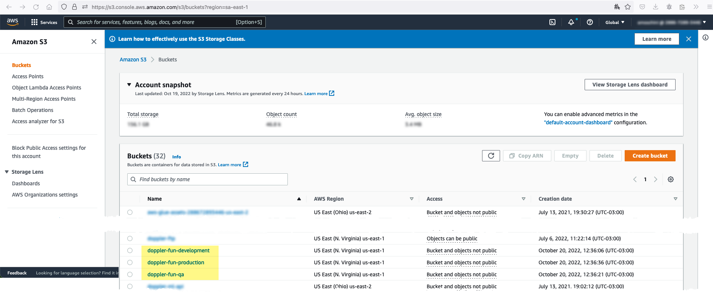
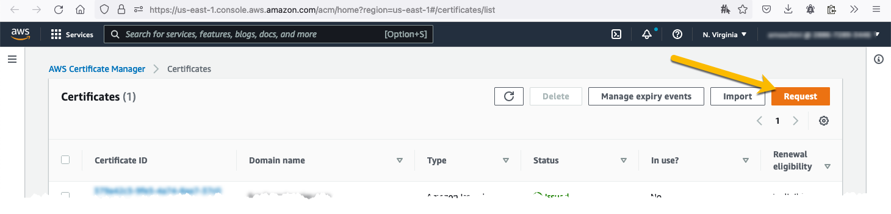
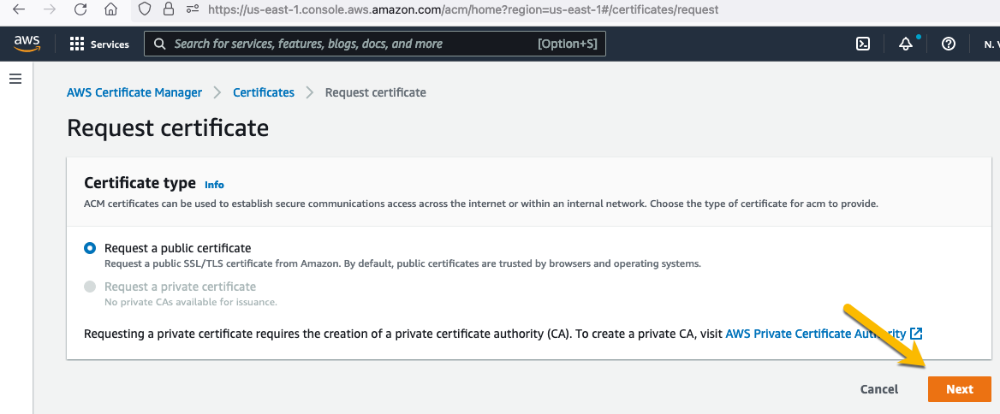
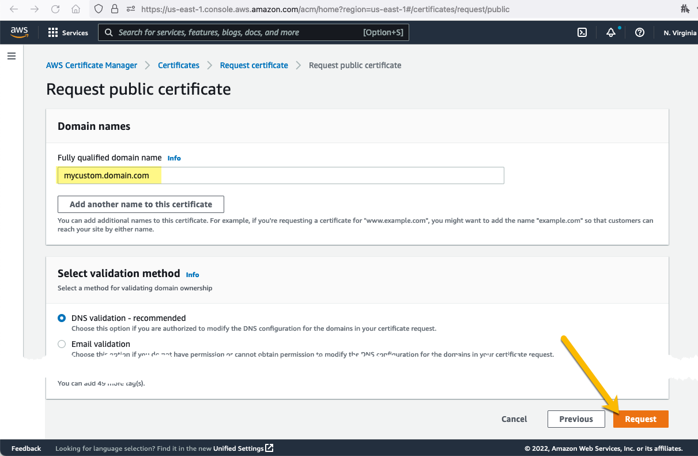
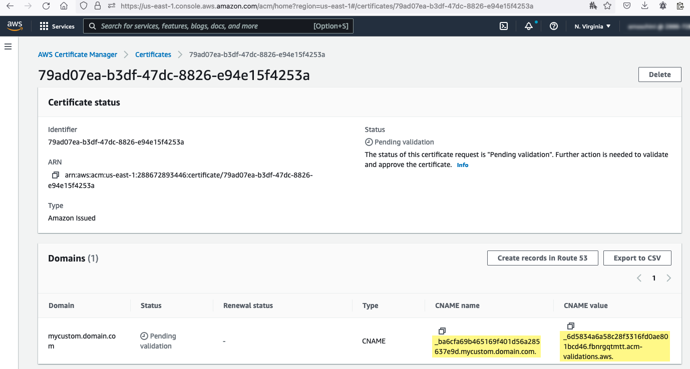
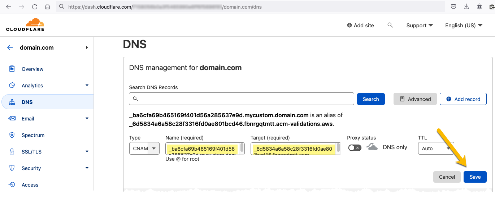
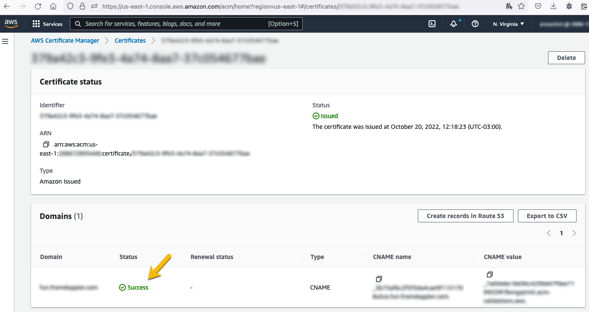
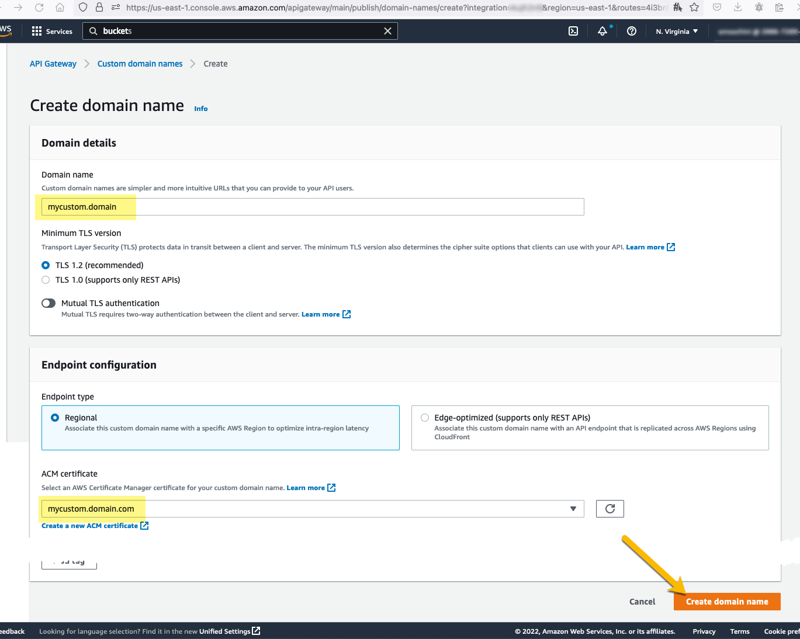
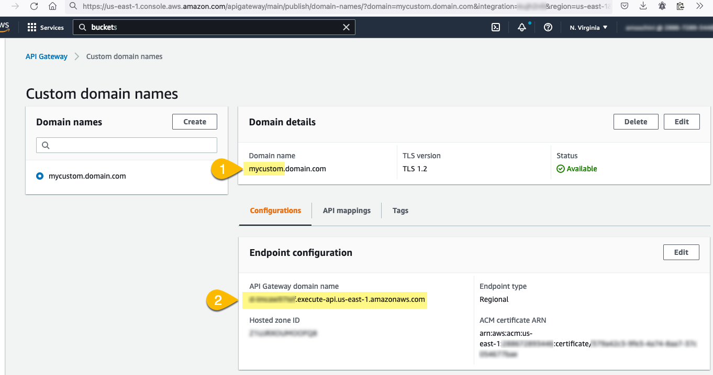
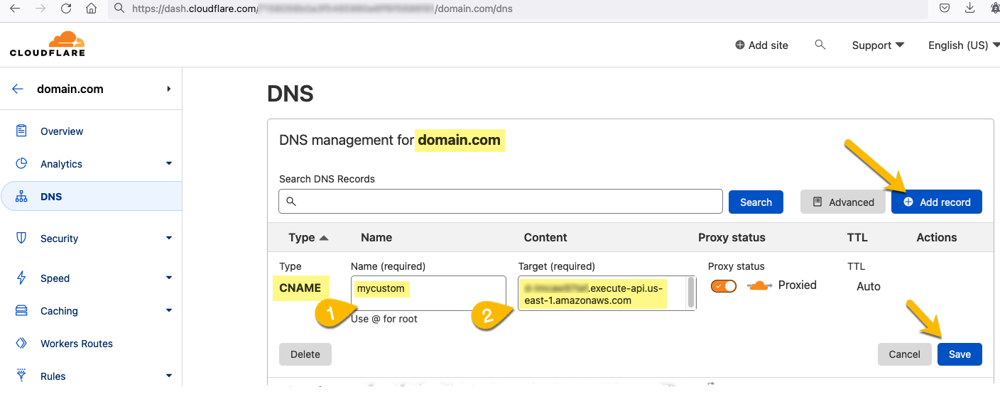

<!--
title: 'AWS Simple HTTP Endpoint example in NodeJS'
description: 'This template demonstrates how to make a simple HTTP API with Node.js running on AWS Lambda and API Gateway using the Serverless Framework.'
layout: Doc
framework: v3
platform: AWS
language: nodeJS
authorLink: 'https://github.com/serverless'
authorName: 'Serverless, inc.'
authorAvatar: 'https://avatars1.githubusercontent.com/u/13742415?s=200&v=4'
-->

# TO DO

- [x] Upload to a public repository

- [x] [DE-829](https://makingsense.atlassian.net/browse/DE-829) Finish Serverless configuration
  - [x] Configure API Gateway? Could it be replaced by Cloudflare?
  - [x] Take a look to Juane's examples
  - [x] Take a look to [Serverless TypeScript Starter](https://github.com/AnomalyInnovations/serverless-typescript-starter)
- [x] [DE-830](https://makingsense.atlassian.net/browse/DE-830) CD in our Jenkins deploying to AWS
  - Docker image with Serverless https://hub.docker.com/r/20minutes/node-16-yarn-serverless-3
  - Docker image with Serverless https://hub.docker.com/r/amaysim/serverless
- [x] [DE-831](https://makingsense.atlassian.net/browse/DE-831) Expose API in a friendly domain
- [x] [DE-832](https://makingsense.atlassian.net/browse/DE-832) Token JWT validation
  - ✔️ JWT Validation runs in the API Gateway or inside the lambdas?
  - ✔️ JWT payload should be available inside the lambdas
- [x] Add all CI validation steps that we run in other projects
- [ ] Nice to have
  - [ ] [DE-833](https://makingsense.atlassian.net/browse/DE-833) Enable test watching
  - [ ] [DE-834](https://makingsense.atlassian.net/browse/DE-834) Return service version (in the headers? in a specific endpoint?)
  - [ ] [DE-835](https://makingsense.atlassian.net/browse/DE-835) Linting errors should break the build

# Serverless Framework Node HTTP API on AWS

This template demonstrates how to make a simple HTTP API with Node.js running on AWS Lambda and API Gateway using the
Serverless Framework.

This template does not include any kind of persistence (database). For more advanced examples, check out the
[serverless/examples repository](https://github.com/serverless/examples/) which includes Typescript, Mongo, DynamoDB
and other examples.

## Manual setup

### Buckets

For the moment, we decided to share a bucket for all lambda functions in the same environment, so we have three:

- `doppler-fun-int-us-east-2`
- `doppler-fun-qa-us-east-2`
- `doppler-fun-production-us-east-2`

Each of them has been created manually using the [S3 Buckets page](https://s3.console.aws.amazon.com/s3/buckets?region=sa-east-2).



### Custom domain

We are using a custom domain for each environment:

- `{custom-domain}.fromdoppler.com/lambdas-poc/` ➡ `lambdas-poc-production` API
- `{custom-domain}qa.fromdoppler.net/lambdas-poc/` ➡ `lambdas-poc-qa` API
- `{custom-domain}int.fromdoppler.net/lambdas-poc/` ➡ `lambdas-poc-int` API

Our custom domain is managed by Cloudflare.

#### Step by step configuration

1. Create a certificate







2. Validate certificate







3. Create custom domain in AWS



4. Add DNS to the custom domain





5. Configure mappings

Now it is done by code 😀

## Usage

### Deployment

```
$ serverless deploy
```

After deploying, you should see output similar to:

```bash
Deploying aws-node-http-api-project to stage dev (us-east-1)

✔ Service deployed to stack aws-node-http-api-project-dev (152s)

endpoint: GET - https://xxxxxxxxxx.execute-api.us-east-1.amazonaws.com/
functions:
  hello: aws-node-http-api-project-dev-hello (1.9 kB)
```

_Note_: In current form, after deployment, your API is public and can be invoked by anyone. For production deployments,
you might want to configure an authorizer. For details on how to do that, refer to
[http event docs](https://www.serverless.com/framework/docs/providers/aws/events/apigateway/).

### Invocation

After successful deployment, you can call the created application via HTTP:

```bash
curl https://xxxxxxx.execute-api.us-east-1.amazonaws.com/
```

Which should result in response similar to the following (removed `input` content for brevity):

```json
{
  "message": "Go Serverless v2.0! Your function executed successfully!",
  "input": {
    ...
  }
}
```

### Local development

You can invoke your function locally by using the following command:

```bash
serverless invoke local --function hello
```

Which should result in response similar to the following:

```
{
  "statusCode": 200,
  "body": "{\n  \"message\": \"Go Serverless v3.0! Your function executed successfully!\",\n  \"input\": \"\"\n}"
}
```

Alternatively, it is also possible to emulate API Gateway and Lambda locally by using `serverless-offline` plugin. In order to do that, execute the following command:

```bash
serverless plugin install -n serverless-offline
```

It will add the `serverless-offline` plugin to `devDependencies` in `package.json` file as well as will add it to `plugins` in `serverless.yml`.

After installation, you can start local emulation with:

```
serverless offline
```

To learn more about the capabilities of `serverless-offline`, please refer to its [GitHub repository](https://github.com/dherault/serverless-offline).
